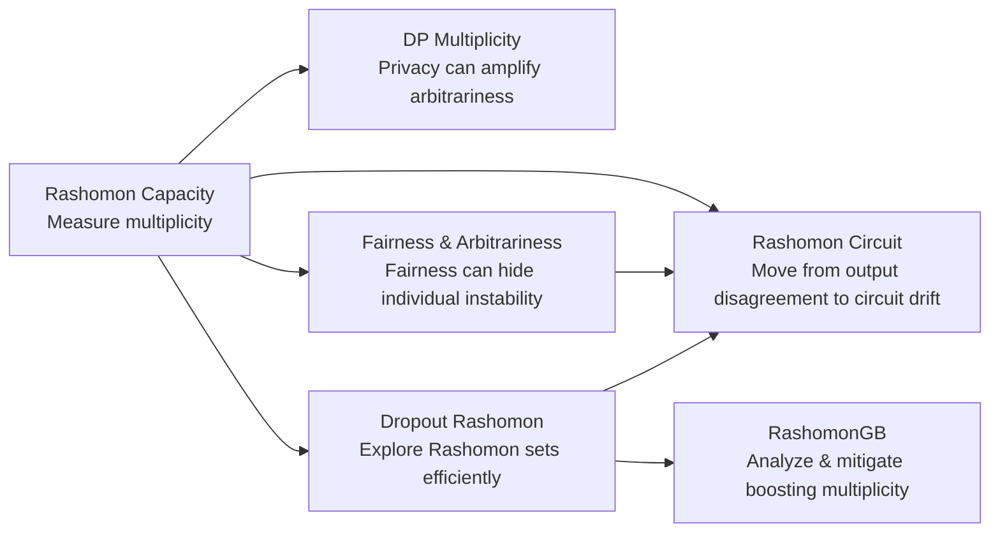

# Knowledge Uncertainty: The Rashomon Effect in Machine Learning

> **When many models look equally good, which decision is actually justified?**
>
> A research portfolio on the **Rashomon effect**, **predictive multiplicity**, and **hidden disagreement** across models, decisions, explanations, and circuits.

Modern ML evaluation is built around averages: accuracy, AUC, loss, fairness gaps, privacy budgets, refusal rates, and attack success rates. These metrics are useful, but they can hide a more uncomfortable failure mode:

> **Two models can look equally good by every aggregate metric, yet make different decisions for the same person, subgroup, prompt, or behavior.**

This is **knowledge uncertainty**. It is not the usual uncertainty of a single model being unsure about its prediction. It is uncertainty over *which equally valid model, decision, explanation, or internal mechanism the learning process could have produced*.

The classical name for this phenomenon is the **Rashomon effect**: many different models can explain the same data nearly equally well. In classification, this becomes **predictive multiplicity**: near-equally accurate models can still disagree on individual predictions. In high-stakes settings, that disagreement is not just a technical detail. It can determine who receives a loan, who is flagged as high risk, who is harmed or helped by a fairness intervention, or whether a language model's safety behavior is stable or fragile.

This repository tells the story of a research line built around one question:

> **If many models are equally accurate, what makes one decision more defensible than another?**

---

## The arc in one picture

The line of work progresses from **measurement** to **hidden costs**, then to **efficient exploration**, **practical model families**, and finally **mechanistic multiplicity** in language models.



The progression is simple:

1. **Measure it.** How much can near-equivalent models disagree?
2. **Audit it.** Do privacy or fairness interventions introduce hidden arbitrariness?
3. **Scale it.** How can we explore large Rashomon sets without retraining many models?
4. **Deploy it.** How does multiplicity appear in widely used model families such as gradient boosting?
5. **Mechanize it.** Can the same instability appear inside LLM circuits, not just in outputs?

---

## Why average metrics are not enough

A model can have excellent average performance and still be hard to justify for a particular individual. If another model with the same accuracy, same privacy guarantee, or same fairness metric would have made a different decision, then the deployed decision is partly determined by arbitrary choices: a random seed, a privacy-noise draw, a fairness post-processing path, a dropout mask, a boosting trajectory, or a prompt transformation.

This is the core deployment risk:

> **Aggregate metrics can certify the system while leaving individual decisions, explanations, and mechanisms unstable.**

Knowledge uncertainty treats this instability as a first-class object of evaluation.

---

## 1. Measuring multiplicity: Rashomon Capacity

The first step is to measure how much near-equivalent models can disagree.

Most early multiplicity metrics focus on hard decisions: do two models predict different labels? But probabilistic classifiers output scores, not only labels. Two models may agree after thresholding while assigning very different probabilities to the same individual. This matters because thresholds can change, downstream decisions may use confidence scores, and stakeholders may care about the range of plausible outcomes.

**Rashomon Capacity** measures score-level predictive multiplicity in the probability simplex. It asks:

> **How much room is there for equally accurate probabilistic classifiers to disagree about this input?**

This work establishes the measurement foundation for the rest of the line: once multiplicity is quantifiable, it can be audited, disclosed, and mitigated.

**Paper:** [Rashomon Capacity: Measuring Predictive Multiplicity in Probabilistic Classification](https://proceedings.neurips.cc/paper_files/paper/2022/file/ba4caa85ecdcafbf9102ab8ec384182d-Paper-Conference.pdf)  
**Code:** [HsiangHsu/rashomon-capacity](https://github.com/HsiangHsu/rashomon-capacity)

---

## 2. Privacy can make decisions more arbitrary

Differential privacy is usually framed as a trade-off between privacy and accuracy. Private training algorithms inject randomness to protect sensitive data. That randomness is necessary, but it can also create multiple equally private, similarly accurate models.

**Arbitrary Decisions are a Hidden Cost of Differentially Private Training** shows that privacy-preserving randomness can increase predictive multiplicity. As privacy becomes stronger, models with the same privacy guarantee and comparable accuracy can disagree more often, and this disagreement can be unevenly distributed across individuals and demographic groups.

The usual two-axis view is incomplete:

```text
privacy  ↔  accuracy
```

This work adds a third axis:

```text
privacy  ↔  accuracy  ↔  arbitrariness
```

The point is not that differential privacy is undesirable. The point is that privacy-preserving training should be audited not only for accuracy loss, but also for whether it makes individual decisions harder to justify.

**Paper:** [Arbitrary Decisions are a Hidden Cost of Differentially Private Training](https://dl.acm.org/doi/pdf/10.1145/3593013.3594103)  
**Code:** [spring-epfl/dp_multiplicity](https://github.com/spring-epfl/dp_multiplicity)

---

## 3. Fairness can hide individual arbitrariness

Group fairness interventions are typically evaluated on two dimensions: accuracy and group fairness violation. If the fairness gap improves while accuracy remains acceptable, the intervention may look successful.

But there is a missing question:

> **Do fair and accurate models make consistent decisions for the same individual?**

**Individual Arbitrariness and Group Fairness** shows that fairness interventions can improve group-level metrics while increasing individual-level arbitrariness. The fairness-accuracy frontier can therefore hide a third dimension: predictive multiplicity.

This is subtle. Fairness constraints do not necessarily make decisions more stable. They can create multiple routes to satisfying the same aggregate fairness condition, and different routes may shift decisions for different individuals.

A stronger responsible-ML target is therefore:

```text
accuracy + group fairness + non-arbitrariness
```

The work also studies ensembling as a mitigation strategy: combining competing models can reduce disagreement while preserving fairness and accuracy.

**Paper:** [Individual Arbitrariness and Group Fairness](https://proceedings.neurips.cc/paper_files/paper/2023/file/d891d240b5784656a0356bf4b00f5cdd-Paper-Conference.pdf)  
**Code:** [Carol-Long/Fairness_and_Arbitrariness](https://github.com/Carol-Long/Fairness_and_Arbitrariness)

---

## 4. Making Rashomon set exploration practical with dropout

Once multiplicity matters, the next bottleneck is computational: measuring predictive multiplicity requires many models in the Rashomon set, but repeatedly retraining neural networks is expensive.

**Dropout-Based Rashomon Set Exploration** turns inference-time dropout into an efficient Rashomon set exploration tool. Instead of training many models from scratch, dropout masks induce a family of nearby models around a trained neural network. With the right parameter choices, these dropout-induced models remain near-optimal and can be used to estimate predictive multiplicity.

The key conceptual shift is:

> **Dropout is not only a regularizer or uncertainty estimator; it can be an efficient probe of near-equivalent models.**

This makes multiplicity auditing much more practical for neural networks.

**Paper:** [Dropout-Based Rashomon Set Exploration for Efficient Predictive Multiplicity Estimation](https://proceedings.iclr.cc/paper_files/paper/2024/file/8cd1ce03ea58b3d7dfd809e4d42f08ea-Paper-Conference.pdf)  
**Code:** [jpmorganchase/dropout-rashomon-set-exploration](https://github.com/jpmorganchase/dropout-rashomon-set-exploration)

---

## 5. RashomonGB: multiplicity in gradient boosting

Neural networks are not the only place multiplicity matters. In finance, healthcare, insurance, fraud detection, and risk modeling, gradient boosting remains one of the most important model families.

**RashomonGB** studies predictive multiplicity in gradient boosting. Boosting is sequential: a final predictor is built by adding weak learners that fit residuals stage by stage. This structure creates a natural way to inspect multiplicity through residual Rashomon sets.

The contribution is both analytic and practical:

- it explains how multiple boosted models can achieve similar performance while making different individual predictions;
- it provides an efficient way to inspect an exponentially large space of boosted models;
- it studies mitigation strategies that reduce predictive multiplicity while preserving performance and fairness.

This extends the agenda from abstract measurement to practical deployment settings where tabular models dominate.

**Paper:** [RashomonGB: Analyzing the Rashomon Effect and Mitigating Predictive Multiplicity in Gradient Boosting](https://proceedings.neurips.cc/paper_files/paper/2024/file/dbd07478c4aac41c0ce411e12f2e5a28-Paper-Conference.pdf)

---

## 6. Rashomon Circuit: from output disagreement to mechanistic disagreement

The final step is to ask whether the Rashomon effect exists not only across model outputs, but also inside the mechanisms that produce them.

In language models, we care not only about whether the model gives a safe answer, but also about how that behavior is implemented. A model may refuse a harmful request under one prompt, but rely on internal features that drift or collapse under a transformation.

**Rashomon Circuit** explores this mechanistic version of the Rashomon question:

> **Can similar safety behavior be supported by unstable internal circuits?**

The demo studies character-level prompt transformations and measures sparse autoencoder feature fingerprints before and after transformation. It distinguishes three regimes:

1. **Stable safety:** the response remains safe and feature fingerprints remain stable.
2. **Jailbreak drift:** safety behavior erodes and internal features drift.
3. **Prompt destruction:** the transformation breaks the prompt, so drift reflects semantic collapse rather than successful jailbreak.

The key lesson is that high circuit drift is not automatically evidence of jailbreak success. It may indicate genuine refusal erosion, but it may also indicate prompt breakage. This turns Rashomon analysis into a mechanistic safety audit: not only *did the output change?*, but *did the underlying mechanism remain stable?*

**Code:** [HsiangHsu/rashomon-circuit](https://github.com/HsiangHsu/rashomon-circuit)

---

## What this line of work argues

Across these projects, the thesis is:

> **Good aggregate performance can hide unstable decisions, unstable explanations, and unstable mechanisms.**

The Rashomon effect shows that model behavior is often not uniquely determined by data and objective alone. It can depend on arbitrary choices in the learning or evaluation pipeline.

Knowledge uncertainty asks us to evaluate not only whether a system performs well on average, but also whether its decisions and mechanisms are stable across near-equivalent alternatives.

This connects questions that are often treated separately:

| Area | Rashomon question |
|---|---|
| **Fairness** | Are group-level improvements hiding individual-level instability? |
| **Privacy** | Does privacy-preserving randomness make decisions harder to justify? |
| **Interpretability** | Are explanations stable across equally good models? |
| **Robustness** | Are decisions stable under perturbations and model-selection choices? |
| **LLM safety** | Are refusal behaviors supported by stable internal circuits or fragile alternatives? |

---

## Related papers and artifacts

| Research artifact | Role in the story | Link |
|---|---|---|
| **Rashomon Capacity** | Defines score-level predictive multiplicity. | [Paper](https://proceedings.neurips.cc/paper_files/paper/2022/file/ba4caa85ecdcafbf9102ab8ec384182d-Paper-Conference.pdf) · [Code](https://github.com/HsiangHsu/rashomon-capacity) |
| **Arbitrary Decisions under Differential Privacy** | Shows privacy can introduce a hidden arbitrariness cost. | [Paper](https://dl.acm.org/doi/pdf/10.1145/3593013.3594103) · [Code](https://github.com/spring-epfl/dp_multiplicity) |
| **Individual Arbitrariness and Group Fairness** | Shows fairness interventions can hide individual instability. | [Paper](https://proceedings.neurips.cc/paper_files/paper/2023/file/d891d240b5784656a0356bf4b00f5cdd-Paper-Conference.pdf) · [Code](https://github.com/Carol-Long/Fairness_and_Arbitrariness) |
| **Dropout Rashomon Set Exploration** | Makes Rashomon set exploration efficient for neural networks. | [Paper](https://proceedings.iclr.cc/paper_files/paper/2024/file/8cd1ce03ea58b3d7dfd809e4d42f08ea-Paper-Conference.pdf) · [Code](https://github.com/jpmorganchase/dropout-rashomon-set-exploration) |
| **RashomonGB** | Analyzes and mitigates predictive multiplicity in gradient boosting. | [Paper](https://proceedings.neurips.cc/paper_files/paper/2024/file/dbd07478c4aac41c0ce411e12f2e5a28-Paper-Conference.pdf) |
| **Rashomon Circuit** | Extends Rashomon thinking to circuit-level instability in LLM safety. | [Code](https://github.com/HsiangHsu/rashomon-circuit) |

---

## Future directions

### Multiplicity-aware model cards

Model documentation should report predictive multiplicity alongside accuracy, fairness, privacy, robustness, and calibration. For high-stakes systems, the key question is not only average performance, but which individuals, groups, or prompt regions are most exposed to arbitrary disagreement.

### Explanation multiplicity

If equally accurate models produce different explanations, feature attributions, counterfactuals, or circuits, interpretability itself has a Rashomon problem. Future work should measure not only prediction disagreement, but also explanation disagreement.

### Circuit-level Rashomon analysis for LLMs

Rashomon Circuit can be extended from jailbreak settings to reasoning, factuality, tool use, refusal, and instruction following. A key question is whether output-stable prompts are also circuit-stable, or whether language models often reach the same answer through unrelated internal routes.

### Multiplicity-aware mitigation

The goal is not simply to average models. The goal is to search the Rashomon set for models that are not only accurate, but also stable, fair, interpretable, robust, and safe. In this view, the Rashomon set is both a risk and a resource.

---

## Suggested citation cluster

```bibtex
@inproceedings{hsu2022rashomon,
  title={Rashomon Capacity: Measuring Predictive Multiplicity in Probabilistic Classification},
  author={Hsu, Hsiang and Calmon, Flavio P.},
  booktitle={Advances in Neural Information Processing Systems},
  year={2022}
}

@inproceedings{kulynych2023arbitrary,
  title={Arbitrary Decisions are a Hidden Cost of Differentially Private Training},
  author={Kulynych, Bogdan and Hsu, Hsiang and Troncoso, Carmela and Calmon, Flavio du Pin},
  booktitle={ACM Conference on Fairness, Accountability, and Transparency},
  year={2023}
}

@inproceedings{long2023individual,
  title={Individual Arbitrariness and Group Fairness},
  author={Long, Carol Xuan and Hsu, Hsiang and Alghamdi, Wael and Calmon, Flavio P.},
  booktitle={Advances in Neural Information Processing Systems},
  year={2023}
}

@inproceedings{hsu2024dropout,
  title={Dropout-Based Rashomon Set Exploration for Efficient Predictive Multiplicity Estimation},
  author={Hsu, Hsiang and Li, Guihong and Hu, Shaohan and Chen, Chun-Fu Richard},
  booktitle={International Conference on Learning Representations},
  year={2024}
}

@inproceedings{hsu2024rashomongb,
  title={RashomonGB: Analyzing the Rashomon Effect and Mitigating Predictive Multiplicity in Gradient Boosting},
  author={Hsu, Hsiang and Brugere, Ivan and Sharma, Shubham and Lecue, Freddy and Chen, Chun-Fu},
  booktitle={Advances in Neural Information Processing Systems},
  year={2024}
}
```

---

## One-line summary

**Knowledge Uncertainty studies hidden disagreement in ML systems: when many models, decisions, explanations, or circuits are equally plausible, responsible deployment requires measuring and reducing the arbitrariness that average metrics fail to reveal.**
