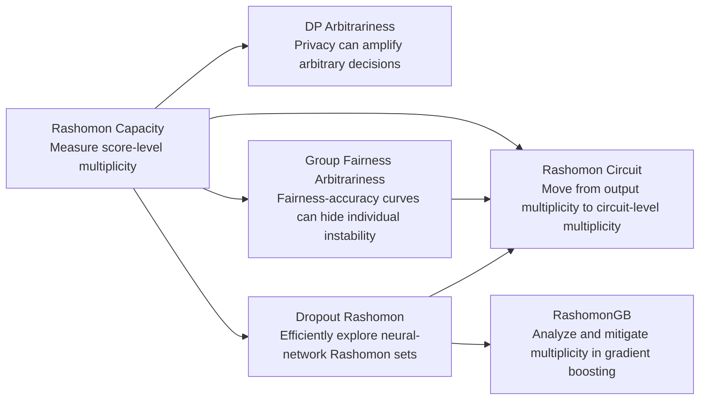

# Rashomon Multiplicity: Knowledge Uncertainty in Machine Learning

> **Understanding when equally accurate models, decisions, or circuits disagree — and why this hidden multiplicity matters for fairness, privacy, interpretability, and AI safety.**

This repository is a **research demo README** that connects a series of papers and open-source artifacts around the **Rashomon effect** and **predictive multiplicity**. The goal is not to provide a new training pipeline, but to present a coherent research line: how uncertainty hides not only in prediction probabilities, but also in the space of near-equally-good models, decisions, and internal mechanisms.

## Core idea

Modern machine learning systems are often under-specified: many models can achieve statistically indistinguishable accuracy, yet make different decisions for the same individual. This phenomenon is known as the **Rashomon effect**. In classification, its decision-level consequence is **predictive multiplicity**: the prediction for an individual may depend on arbitrary choices such as random seed, injected privacy noise, fairness post-processing path, dropout mask, or model-selection procedure.

This line of work asks:

> If many models are equally accurate, which decision is justified — and what happens when those models disagree?

The answer has evolved across five stages:

1. **Measure multiplicity** in probabilistic classification.
2. **Audit hidden arbitrariness costs** introduced by privacy and fairness interventions.
3. **Scale Rashomon set exploration** beyond expensive retraining.
4. **Analyze multiplicity in widely used model families** such as gradient boosting.
5. **Extend Rashomon thinking from outputs to circuits** in large language models and jailbreak behavior.



---

## Why this matters

Standard model evaluation usually reports average metrics: accuracy, AUC, fairness gaps, privacy parameters, or attack success rate. These metrics can miss a different failure mode:

> Two models can look equally good on aggregate metrics but disagree on who receives a loan, who is flagged as high risk, who benefits from a fairness correction, or which internal circuit supports a safety behavior.

This matters because arbitrariness is not evenly distributed. Some individuals, subgroups, prompts, or behaviors may be far more exposed to model disagreement than others. Therefore, predictive multiplicity should be treated as a first-class deployment risk, alongside accuracy, fairness, privacy, robustness, and interpretability.

---

## Research artifacts

| Artifact | Venue / Status | Main question | Link |
|---|---:|---|---|
| **Rashomon Capacity** | NeurIPS 2022 | How do we measure predictive multiplicity for probabilistic classifiers without reducing everything to thresholded labels? | [Paper](https://proceedings.neurips.cc/paper_files/paper/2022/file/ba4caa85ecdcafbf9102ab8ec384182d-Paper-Conference.pdf) · [Code](https://github.com/HsiangHsu/rashomon-capacity) |
| **Arbitrary Decisions under Differential Privacy** | FAccT 2023 | Does privacy-preserving randomization create a hidden arbitrariness cost? | [Paper](https://dl.acm.org/doi/pdf/10.1145/3593013.3594103) |
| **Individual Arbitrariness and Group Fairness** | NeurIPS 2023 | Can fairness interventions improve group metrics while making individual decisions more arbitrary? | [Paper](https://proceedings.neurips.cc/paper_files/paper/2023/file/d891d240b5784656a0356bf4b00f5cdd-Paper-Conference.pdf) |
| **Dropout Rashomon Set Exploration** | ICLR 2024 | Can we explore neural-network Rashomon sets without repeatedly retraining many models? | [Paper](https://proceedings.iclr.cc/paper_files/paper/2024/file/8cd1ce03ea58b3d7dfd809e4d42f08ea-Paper-Conference.pdf) · [Code](https://github.com/jpmorganchase/dropout-rashomon-set-exploration) |
| **RashomonGB** | NeurIPS 2024 | How does predictive multiplicity arise in gradient boosting, and can it be mitigated? | [Paper](https://proceedings.neurips.cc/paper_files/paper/2024/file/dbd07478c4aac41c0ce411e12f2e5a28-Paper-Conference.pdf) |
| **Rashomon Circuit** | Demo / ongoing | Can the Rashomon effect be lifted from model outputs to internal circuits in LLM safety? | [Code](https://github.com/HsiangHsu/rashomon-circuit) |

---

## 1. Rashomon Capacity: measuring predictive multiplicity in probabilistic classification

**Problem.** Existing multiplicity metrics often focus on thresholded labels: do two equally good classifiers output different classes? This is important, but it can be too coarse. Probabilistic classifiers output score vectors, and two models may differ meaningfully even before the final argmax decision.

**Breakthrough.** **Rashomon Capacity** introduces an information-theoretic metric for score-level predictive multiplicity. Instead of asking only whether predictions flip, it measures how much variation exists in the probability simplex across models in the Rashomon set.

**Key insight.** Predictive multiplicity is an individual-level property. A model can have strong average accuracy while still exposing a tail of individuals to highly unstable predictions.

**Contribution to the research line.** This work establishes the measurement foundation. It gives the rest of the agenda a language for saying: average performance is not enough; we must quantify how much arbitrary variation exists across equally good models.

**Repository.** [`HsiangHsu/rashomon-capacity`](https://github.com/HsiangHsu/rashomon-capacity) implements Rashomon Capacity estimation using:

- random sampling / retraining to approximate Rashomon sets;
- adversarial weight perturbation to search for score-diverse competing models;
- experiments on UCI Adult, COMPAS, HSLS, and CIFAR-10.

---

## 2. Arbitrary Decisions are a Hidden Cost of Differentially Private Training

**Problem.** Differential privacy protects training data by injecting randomness into learning. The usual trade-off is framed as privacy versus accuracy. But privacy noise can also change which equally private, equally accurate model is obtained.

**Breakthrough.** This work shows that **privacy-preserving training can increase predictive multiplicity**. The same training data, privacy level, and model class can produce models that satisfy the same privacy guarantee and have comparable accuracy, yet disagree on individual examples.

**Key insight.** Privacy has a hidden third cost beyond accuracy: **decision arbitrariness**. As privacy becomes stronger, the region of examples with high disagreement can grow, and this burden can be unevenly distributed across individuals and demographic groups.

**Contribution to the research line.** Rashomon Capacity asked how to measure multiplicity. This work shows why it matters for privacy: a model can be formally private and statistically accurate while making decisions that are hard to justify for individuals.

---

## 3. Individual Arbitrariness and Group Fairness

**Problem.** Fairness interventions are usually evaluated on two axes: group fairness and accuracy. But if multiple fair and accurate models disagree on individual decisions, then group fairness alone does not guarantee non-arbitrariness.

**Breakthrough.** This work shows that state-of-the-art fairness interventions can **improve group fairness metrics while exacerbating predictive multiplicity**. In other words, the fairness-accuracy frontier can hide a third axis: individual arbitrariness.

**Key insight.** Fairness constraints do not necessarily shrink the set of acceptable decisions in a way that improves individual consistency. In some settings, they can create multiple paths to group fairness, each affecting different individuals.

**Contribution to the research line.** This work turns predictive multiplicity into a fairness problem. It argues that responsible ML should evaluate:

1. accuracy,
2. group fairness,
3. individual-level arbitrariness.

It also proposes an ensemble-based mitigation strategy that improves consistency while preserving fairness and accuracy.

---

## 4. Dropout-Based Rashomon Set Exploration

**Problem.** Measuring predictive multiplicity requires exploring many models in the Rashomon set. The naïve strategy — retraining many models with different random seeds — is expensive and often impractical for neural networks.

**Breakthrough.** This work uses **inference-time dropout** to efficiently explore the Rashomon set. Instead of retraining many models from scratch, dropout masks generate competing models around a trained neural network. With proper parameter choices, these dropout-induced models can remain within the near-optimal loss region.

**Key insight.** Dropout is not only a regularizer or Bayesian uncertainty approximation. It can also be used as a practical Rashomon set exploration tool, provided we explicitly constrain attention to near-equally-performing models.

**Contribution to the research line.** This work makes multiplicity estimation scalable for neural networks. It bridges the gap between conceptual measurement and practical auditing by reducing the cost of finding competing models.

**Repository.** [`jpmorganchase/dropout-rashomon-set-exploration`](https://github.com/jpmorganchase/dropout-rashomon-set-exploration) contains:

- retraining, dropout, and adversarial weight perturbation strategies;
- predictive multiplicity metrics such as ambiguity, discrepancy, disagreement, variance, viable prediction range, and Rashomon Capacity;
- tabular, vision, and detection experiments;
- dropout ensemble and model-selection methods for mitigation.

---

## 5. RashomonGB: multiplicity in gradient boosting

**Problem.** Gradient boosting is one of the most widely used model families for tabular data, especially in high-stakes industry settings. Yet the Rashomon effect in boosting had been underexplored compared with linear models, decision trees, and neural networks.

**Breakthrough.** **RashomonGB** analyzes how multiplicity emerges from the sequential structure of gradient boosting. Instead of treating a boosted model as a monolithic predictor, it decomposes the learning process into residual fitting stages and studies the Rashomon effect across weak learners.

**Key insight.** Boosting creates a structured search space: each stage has residual models that can be swapped while preserving comparable final performance. This provides an efficient route to inspect multiplicity in an exponentially large set of boosted models.

**Contribution to the research line.** This work expands the agenda from neural networks to practical tabular ML. It also moves from measuring multiplicity to **mitigating** it through model selection and ensemble-style stabilization in gradient boosting.

---

## 6. Rashomon Circuit: from output multiplicity to mechanistic multiplicity

**Problem.** In large language models, two prompts or transformations may produce similar high-level behavior while relying on different internal mechanisms. Conversely, internal circuit drift may not always correspond to visible behavioral failure. This raises a new question:

> Can the Rashomon effect appear not only across models or predictions, but across circuits?

**Breakthrough.** **Rashomon Circuit** reframes predictive multiplicity as a mechanistic interpretability problem. Instead of only asking whether outputs disagree, it asks whether the internal SAE feature fingerprints supporting safety behavior remain stable under prompt transformations such as bijection attacks.

**Key insight.** There are at least three regimes under perturbation:

1. **Stable safety** — output remains safe and internal feature overlap remains high.
2. **Jailbreak drift** — safety behavior erodes and circuit fingerprints drift.
3. **Prompt destruction** — the perturbation is too strong; the model no longer understands the request, so high drift reflects breakage rather than successful jailbreak.

This distinction matters because high circuit drift is not automatically evidence of attack success. It may indicate genuine safety failure, prompt destruction, or unresolved non-refusal behavior.

**Contribution to the research line.** This demo extends the Rashomon agenda from classical decision-making to LLM safety:

- from **model-level multiplicity** to **circuit-level multiplicity**;
- from **individual decision instability** to **prompt and behavior instability**;
- from **fairness/privacy auditing** to **mechanistic safety auditing**.

**Repository.** [`HsiangHsu/rashomon-circuit`](https://github.com/HsiangHsu/rashomon-circuit) studies bijection-style prompt transformations on JailbreakBench-style behaviors using:

- Gemma-family instruction models;
- GemmaScope sparse autoencoder features;
- top-k SAE feature fingerprints;
- Rashomon Feature Overlap (RFO);
- Rashomon Circuit Drift (RCD);
- safe / unsafe / gibberish outcome taxonomy.

---

## The evolution of the research line

### Stage 1 — Measurement

**Rashomon Capacity** establishes that predictive multiplicity can be measured at the level of probabilistic scores, not only hard decisions. This makes multiplicity visible and reportable.

### Stage 2 — Hidden costs

The DP and fairness papers show that multiplicity is not a niche pathology. It can be introduced or amplified by mechanisms that are otherwise considered responsible: privacy-preserving training and fairness interventions.

### Stage 3 — Efficient exploration

The dropout paper addresses the computational bottleneck: if multiplicity matters, we need efficient ways to find competing models. Dropout turns Rashomon set exploration from repeated retraining into an inference-time auditing procedure.

### Stage 4 — Practical model families

RashomonGB moves the agenda into gradient boosting, a dominant model class for tabular data. This makes multiplicity auditing more relevant to real-world financial, healthcare, and risk-decision pipelines.

### Stage 5 — Mechanistic multiplicity

Rashomon Circuit pushes the concept into LLM interpretability and safety. It asks whether hidden multiplicity exists not only in outputs, but in the internal circuits that support behavior.

---

## Unifying thesis

Across these projects, the central thesis is:

> **Good average performance can hide unstable decisions, unstable mechanisms, and unstable explanations.**

The Rashomon effect is therefore not only a model-selection curiosity. It is a framework for auditing **knowledge uncertainty**:

- uncertainty over which model is selected;
- uncertainty over which individual receives which decision;
- uncertainty over whether privacy or fairness interventions introduce arbitrary outcomes;
- uncertainty over which internal circuit implements a behavior;
- uncertainty over whether a safety mechanism is robust or merely one of many fragile solutions.

---

## Future directions

### 1. Rashomon circuits for reasoning and safety

Extend Rashomon Circuit beyond bijection jailbreaks to reasoning, refusal, factuality, and tool-use settings. The key question is whether output-stable prompts are also circuit-stable, or whether models can reach the same answer through many unrelated internal routes.

### 2. Multiplicity-aware model cards

Add predictive multiplicity and circuit-drift summaries to model documentation. Instead of reporting only average accuracy, fairness, privacy, or ASR, model cards should include tail-risk statistics:

- which individuals or prompts have high multiplicity;
- which groups are disproportionately affected;
- which transformations induce large circuit drift;
- whether high drift corresponds to real behavioral failure or merely input destruction.

### 3. Multiplicity-aware deployment decisions

For high-stakes decisions, predictive multiplicity can guide abstention, human review, or model selection. If an individual lies in a high-Rashomon region, a single model prediction may be insufficiently justified.

### 4. From output disagreement to explanation disagreement

Future work should measure whether equally accurate models also produce conflicting explanations, feature attributions, circuits, counterfactuals, or rationales. This connects Rashomon multiplicity to interpretability faithfulness.

### 5. Multiplicity mitigation as alignment

Mitigation should not simply average models. It should select or steer models toward stable, fair, interpretable, and robust regions of the Rashomon set. This turns multiplicity from a hidden risk into a resource for alignment and model selection.

---

## Suggested citation cluster

```bibtex
@inproceedings{hsu2022rashomon,
  title={Rashomon Capacity: Measuring Predictive Multiplicity in Probabilistic Classification},
  author={Hsu, Hsiang and Calmon, Flavio P.},
  booktitle={Advances in Neural Information Processing Systems},
  year={2022}
}

@inproceedings{kulynych2023arbitrary,
  title={Arbitrary Decisions are a Hidden Cost of Differentially Private Training},
  author={Kulynych, Bogdan and Hsu, Hsiang and Troncoso, Carmela and Calmon, Flavio du Pin},
  booktitle={ACM Conference on Fairness, Accountability, and Transparency},
  year={2023}
}

@inproceedings{long2023individual,
  title={Individual Arbitrariness and Group Fairness},
  author={Long, Carol Xuan and Hsu, Hsiang and Alghamdi, Wael and Calmon, Flavio P.},
  booktitle={Advances in Neural Information Processing Systems},
  year={2023}
}

@inproceedings{hsu2024dropout,
  title={Dropout-Based Rashomon Set Exploration for Efficient Predictive Multiplicity Estimation},
  author={Hsu, Hsiang and Li, Guihong and Hu, Shaohan and Chen, Chun-Fu Richard},
  booktitle={International Conference on Learning Representations},
  year={2024}
}

@inproceedings{hsu2024rashomongb,
  title={RashomonGB: Analyzing the Rashomon Effect and Mitigating Predictive Multiplicity in Gradient Boosting},
  author={Hsu, Hsiang and Brugere, Ivan and Sharma, Shubham and Lecue, Freddy and Chen, Chun-Fu},
  booktitle={Advances in Neural Information Processing Systems},
  year={2024}
}
```

---

## One-line summary

**This research line studies the hidden instability of machine learning systems: when many models, decisions, or circuits are equally plausible, responsible deployment requires measuring, explaining, and mitigating the arbitrariness that average metrics fail to reveal.**
