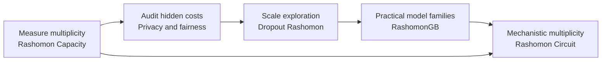

# Knowledge Uncertainty: The Rashomon Effect in Machine Learning

> **When many models are equally accurate, which model should we trust?**
>
> This repository is a narrative research artifact connecting a line of work on the **Rashomon effect**, **predictive multiplicity**, and **hidden disagreement** across models, decisions, and circuits.

Modern machine learning evaluation is built around averages. We report accuracy, AUC, loss, privacy budgets, fairness gaps, or attack success rates. These numbers are useful, but they hide a deeper question:

**What if there are many models that look equally good by these metrics, but make different decisions for the same person, subgroup, prompt, or behavior?**

This is the problem of **knowledge uncertainty**. Not uncertainty in the usual sense of a single model being unsure about its prediction, but uncertainty over *which equally valid model, decision, or mechanism the learning process could have produced*.

The classical name for this phenomenon is the **Rashomon effect**: many different models can explain the same data nearly equally well. In classification, this becomes **predictive multiplicity**: models with nearly indistinguishable performance can still disagree on individual predictions. In high-stakes settings, that disagreement is not just a technical curiosity. It can determine who receives a loan, who is flagged as high risk, who benefits from a fairness intervention, or whether a safety behavior in a language model is robust or fragile.

This repository tells the story of a research line that starts from one question:

> **If many models are equally accurate, what makes one decision more justified than another?**

It then follows that question across five settings: probabilistic classification, privacy, fairness, neural networks, gradient boosting, and finally LLM circuits.

---

## The research arc

The projects in this repository are not isolated papers. They form a progression.

First, we need to **measure** multiplicity. If equally accurate models disagree, how much do they disagree, and for whom?

Then, we need to understand where multiplicity comes from. It can be amplified by mechanisms that are normally considered responsible, such as differential privacy and group fairness interventions.

Next, we need to make multiplicity auditing practical. Exploring the full Rashomon set is usually impossible, so we need efficient ways to find many near-equally-good models without repeatedly retraining from scratch.

Finally, in modern language models, the same idea becomes mechanistic: even when outputs look similar, the internal circuits that support those outputs may differ. The Rashomon effect may exist not only across models and decisions, but also across explanations and mechanisms.



---

## 1. Measuring multiplicity: Rashomon Capacity

The starting point is simple: two classifiers may have the same accuracy but output different probabilities for the same example. Existing multiplicity metrics often focus on thresholded decisions, such as whether two models assign different labels. That matters, but it can miss a more fine-grained form of instability.

A probabilistic classifier does not only say “yes” or “no.” It outputs a score vector. Two models may agree after thresholding but still disagree substantially in confidence. That score-level disagreement matters because thresholds can change, downstream decisions can depend on calibrated probabilities, and stakeholders may care about the range of plausible predictions.

**Rashomon Capacity** was introduced to measure this score-level multiplicity. It treats the output of competing probabilistic classifiers as points in the probability simplex and asks how much variation the Rashomon set permits for a target input.

The key shift is from asking:

> Do two models make different hard decisions?

To asking:

> How much room is there for equally accurate models to disagree about this individual?

This establishes the measurement foundation for the rest of the research line. Once multiplicity can be quantified, it can be audited, disclosed, and eventually mitigated.

**Paper:** [Rashomon Capacity: Measuring Predictive Multiplicity in Probabilistic Classification](https://proceedings.neurips.cc/paper_files/paper/2022/file/ba4caa85ecdcafbf9102ab8ec384182d-Paper-Conference.pdf)  
**Code:** [HsiangHsu/rashomon-capacity](https://github.com/HsiangHsu/rashomon-capacity)

---

## 2. Privacy can make decisions more arbitrary

Differential privacy is usually presented as a trade-off between privacy and accuracy. To protect sensitive training data, private training algorithms inject randomness into learning. That randomness is necessary for privacy, but it also means that the same dataset, model class, and privacy level can produce different models.

The question is whether those different private models merely differ internally, or whether they disagree on individual decisions.

**Arbitrary Decisions are a Hidden Cost of Differentially Private Training** shows that privacy-preserving randomization can increase predictive multiplicity. As privacy becomes stronger, equally private and similarly accurate models can disagree more often, and this burden can be unevenly distributed across individuals and demographic groups.

This adds a third axis to the usual privacy discussion:

```text
privacy  ↔  accuracy  ↔  arbitrariness
```

The point is not that differential privacy is undesirable. The point is that privacy-preserving training can introduce a hidden decision cost that average accuracy does not reveal. A model can satisfy a formal privacy guarantee and still produce decisions that are difficult to justify for individuals because another equally private, equally accurate model would have decided differently.

**Paper:** [Arbitrary Decisions are a Hidden Cost of Differentially Private Training](https://dl.acm.org/doi/pdf/10.1145/3593013.3594103)

---

## 3. Fairness can hide individual arbitrariness

Group fairness interventions are usually evaluated with two metrics: accuracy and a group fairness violation. If the fairness gap decreases while accuracy remains acceptable, the intervention is often considered successful.

But this view misses an important question:

> Do fair and accurate models make consistent decisions for the same individual?

**Individual Arbitrariness and Group Fairness** shows that fairness interventions can improve group-level fairness metrics while increasing predictive multiplicity. In other words, the fairness-accuracy frontier can hide individual instability.

This is counterintuitive at first. One might expect fairness constraints to shrink the space of acceptable models and therefore reduce disagreement. But group fairness constraints can create multiple routes to satisfying aggregate fairness. Different models can satisfy the same group-level constraint by changing decisions for different individuals.

This motivates a broader view of responsible ML. A deployed model should not only be accurate and group-fair. It should also avoid unnecessary individual-level arbitrariness.

```text
accuracy + group fairness is not enough
accuracy + group fairness + non-arbitrariness is the stronger target
```

The paper also studies ensembling as a mitigation strategy: by combining competing models, one can reduce disagreement while preserving fairness and accuracy.

**Paper:** [Individual Arbitrariness and Group Fairness](https://proceedings.neurips.cc/paper_files/paper/2023/file/d891d240b5784656a0356bf4b00f5cdd-Paper-Conference.pdf)

---

## 4. Making Rashomon set exploration practical with dropout

Once predictive multiplicity matters, a practical problem appears immediately: to measure it, we need access to many models in the Rashomon set. But the Rashomon set can be enormous, and repeatedly retraining neural networks with different random seeds is expensive.

**Dropout-Based Rashomon Set Exploration** addresses this computational bottleneck. The idea is to use inference-time dropout as a way to generate many competing models around a trained neural network. Instead of retraining from scratch, dropout masks induce a family of nearby models. With appropriate parameter choices, these models can remain within a near-optimal loss region and therefore serve as an empirical Rashomon set.

The conceptual move is important. Dropout is not treated merely as regularization or Bayesian uncertainty approximation. It becomes a tool for exploring near-equally-performing models.

This shifts multiplicity auditing from a heavy retraining procedure to a lightweight inference-time procedure.

The repository implements multiple exploration and evaluation strategies, including retraining, dropout, adversarial weight perturbation, and several predictive multiplicity metrics.

**Paper:** [Dropout-Based Rashomon Set Exploration for Efficient Predictive Multiplicity Estimation](https://proceedings.iclr.cc/paper_files/paper/2024/file/8cd1ce03ea58b3d7dfd809e4d42f08ea-Paper-Conference.pdf)  
**Code:** [jpmorganchase/dropout-rashomon-set-exploration](https://github.com/jpmorganchase/dropout-rashomon-set-exploration)

---

## 5. RashomonGB: multiplicity in gradient boosting

Neural networks are not the only models where multiplicity matters. In many real-world tabular applications, especially in finance, healthcare, insurance, and risk modeling, gradient boosting remains one of the most important model families.

**RashomonGB** studies the Rashomon effect in gradient boosting. The key observation is that boosting is sequential: a final model is built by adding weak learners that fit residuals stage by stage. This structure creates a natural way to analyze multiplicity. Instead of treating the boosted model as one monolithic predictor, RashomonGB studies the residual Rashomon sets that arise at different boosting stages.

This gives a structured view of why multiple boosted models can achieve similar performance while making different predictions.

It also moves the research line from measurement toward mitigation. If we can efficiently inspect the Rashomon effect in gradient boosting, we can also select or combine models to reduce predictive multiplicity while preserving performance and fairness.

**Paper:** [RashomonGB: Analyzing the Rashomon Effect and Mitigating Predictive Multiplicity in Gradient Boosting](https://proceedings.neurips.cc/paper_files/paper/2024/file/dbd07478c4aac41c0ce411e12f2e5a28-Paper-Conference.pdf)

---

## 6. Rashomon Circuit: from prediction instability to mechanistic instability

The next step is to move beyond classical predictive models.

In large language models, we often care not only about whether a model gives a safe or unsafe answer, but also about *how* that behavior is implemented internally. Two prompts may produce similar outputs while relying on different internal features. Conversely, a perturbation may dramatically change internal activations without producing a meaningful behavioral failure.

This motivates a circuit-level version of the Rashomon question:

> Can there be many internal mechanisms that support similar behavior, and can those mechanisms disagree or drift under prompt transformations?

**Rashomon Circuit** explores this question in the context of jailbreak behavior. It studies prompt transformations such as bijection attacks and measures how sparse autoencoder feature fingerprints change across original and transformed prompts.

The important distinction is that not all drift means the same thing. Under a perturbation, a model response can fall into at least three regimes:

1. **Stable safety:** the model remains safe and the relevant feature fingerprints remain stable.
2. **Jailbreak drift:** the safety behavior erodes and the circuit fingerprint changes.
3. **Prompt destruction:** the perturbation is so strong that the model no longer understands the input, so circuit drift reflects broken semantics rather than a successful jailbreak.

This turns the Rashomon effect into a mechanistic safety lens. The question is no longer only whether equally accurate models disagree. It is whether apparently similar behaviors are supported by stable or unstable internal mechanisms.

**Code:** [HsiangHsu/rashomon-circuit](https://github.com/HsiangHsu/rashomon-circuit)

---

## The unifying thesis

Across these projects, the central thesis is:

> **Good aggregate performance can hide unstable decisions, unstable mechanisms, and unstable explanations.**

The Rashomon effect reveals that a model prediction is not always a uniquely determined consequence of the data. Sometimes it is the result of arbitrary choices in the learning pipeline: random seeds, privacy noise, fairness constraints, dropout masks, boosting paths, or prompt transformations.

This is why I frame this research line as **Knowledge Uncertainty**.

A machine learning system may appear to “know” something because it performs well on average. But if many equally valid models or circuits would act differently, then the system's knowledge is less stable than aggregate metrics suggest.

This perspective connects several questions that are often studied separately:

- **Fairness:** Are group-level improvements hiding individual-level instability?
- **Privacy:** Does privacy-preserving randomness make decisions harder to justify?
- **Interpretability:** Are explanations stable across equally good models?
- **Robustness:** Are decisions stable under perturbations and model-selection choices?
- **AI safety:** Are refusal and safety behaviors implemented by stable internal circuits or fragile alternatives?

---

## Why this matters for deployment

In low-stakes applications, predictive multiplicity may be a tolerable nuisance. In high-stakes applications, it becomes a deployment risk.

If two equally accurate models disagree on whether someone receives a loan, the decision is not fully explained by the data. It is partly explained by arbitrary choices in training or model selection. If a fairness intervention improves a group metric by shifting instability onto a subset of individuals, the intervention may look successful while creating a new form of harm. If a private model protects training data but makes decisions highly sensitive to privacy noise, the model may be difficult to justify in individual cases.

The same logic applies to LLM safety. If a model refuses harmful requests under one prompt but relies on unstable circuits that collapse under a transformation, then average refusal rate is not enough. We need to understand the multiplicity of behaviors and mechanisms around the safety boundary.

The practical implication is simple:

> Models should be evaluated not only by how well they perform on average, but also by how stable their decisions and mechanisms are across the Rashomon set.

---

## Future directions

### Multiplicity-aware model cards

Model cards should include predictive multiplicity statistics alongside accuracy, fairness, privacy, robustness, and calibration. For high-stakes systems, documentation should report which individuals, groups, or prompt regions are most exposed to arbitrary disagreement.

### Explanation multiplicity

If equally accurate models produce different explanations, feature attributions, counterfactuals, or circuits, then interpretability itself has a Rashomon problem. Future work should measure not only prediction disagreement, but also explanation disagreement.

### Circuit-level Rashomon analysis for LLMs

Rashomon Circuit can be extended from jailbreak settings to reasoning, factuality, tool use, refusal, and instruction following. A key question is whether output-stable prompts are also circuit-stable, or whether language models frequently reach the same answer through many unrelated internal routes.

### Multiplicity-aware mitigation

Mitigation should not simply average models blindly. The goal is to search the Rashomon set for models that are not only accurate, but also stable, fair, interpretable, robust, and safe. In this view, the Rashomon set is not only a risk. It is also a resource for alignment and model selection.

### Knowledge uncertainty as an AI safety primitive

In foundation models, uncertainty is not only about probability calibration. It is also about which knowledge source, internal feature, or circuit is being used. Understanding and controlling this uncertainty may become central to reliable inference-time steering, mechanistic auditing, and safe deployment.

---

## Related papers and artifacts

| Research artifact | Main contribution | Link |
|---|---|---|
| **Rashomon Capacity** | Measures score-level predictive multiplicity in probabilistic classification. | [Paper](https://proceedings.neurips.cc/paper_files/paper/2022/file/ba4caa85ecdcafbf9102ab8ec384182d-Paper-Conference.pdf) · [Code](https://github.com/HsiangHsu/rashomon-capacity) |
| **Arbitrary Decisions under Differential Privacy** | Shows that differentially private training can introduce a hidden arbitrariness cost. | [Paper](https://dl.acm.org/doi/pdf/10.1145/3593013.3594103) |
| **Individual Arbitrariness and Group Fairness** | Shows that fairness interventions can improve group metrics while increasing individual arbitrariness. | [Paper](https://proceedings.neurips.cc/paper_files/paper/2023/file/d891d240b5784656a0356bf4b00f5cdd-Paper-Conference.pdf) |
| **Dropout Rashomon Set Exploration** | Uses inference-time dropout to efficiently explore neural-network Rashomon sets. | [Paper](https://proceedings.iclr.cc/paper_files/paper/2024/file/8cd1ce03ea58b3d7dfd809e4d42f08ea-Paper-Conference.pdf) · [Code](https://github.com/jpmorganchase/dropout-rashomon-set-exploration) |
| **RashomonGB** | Analyzes and mitigates predictive multiplicity in gradient boosting. | [Paper](https://proceedings.neurips.cc/paper_files/paper/2024/file/dbd07478c4aac41c0ce411e12f2e5a28-Paper-Conference.pdf) |
| **Rashomon Circuit** | Extends Rashomon thinking to circuit-level instability in LLM jailbreak behavior. | [Code](https://github.com/HsiangHsu/rashomon-circuit) |

---

## Suggested citation cluster

```bibtex
@inproceedings{hsu2022rashomon,
  title={Rashomon Capacity: Measuring Predictive Multiplicity in Probabilistic Classification},
  author={Hsu, Hsiang and Calmon, Flavio P.},
  booktitle={Advances in Neural Information Processing Systems},
  year={2022}
}

@inproceedings{kulynych2023arbitrary,
  title={Arbitrary Decisions are a Hidden Cost of Differentially Private Training},
  author={Kulynych, Bogdan and Hsu, Hsiang and Troncoso, Carmela and Calmon, Flavio du Pin},
  booktitle={ACM Conference on Fairness, Accountability, and Transparency},
  year={2023}
}

@inproceedings{long2023individual,
  title={Individual Arbitrariness and Group Fairness},
  author={Long, Carol Xuan and Hsu, Hsiang and Alghamdi, Wael and Calmon, Flavio P.},
  booktitle={Advances in Neural Information Processing Systems},
  year={2023}
}

@inproceedings{hsu2024dropout,
  title={Dropout-Based Rashomon Set Exploration for Efficient Predictive Multiplicity Estimation},
  author={Hsu, Hsiang and Li, Guihong and Hu, Shaohan and Chen, Chun-Fu Richard},
  booktitle={International Conference on Learning Representations},
  year={2024}
}

@inproceedings{hsu2024rashomongb,
  title={RashomonGB: Analyzing the Rashomon Effect and Mitigating Predictive Multiplicity in Gradient Boosting},
  author={Hsu, Hsiang and Brugere, Ivan and Sharma, Shubham and Lecue, Freddy and Chen, Chun-Fu},
  booktitle={Advances in Neural Information Processing Systems},
  year={2024}
}
```

---

## One-line summary

**Knowledge Uncertainty studies the hidden disagreement of machine learning systems: when many models, decisions, or circuits are equally plausible, responsible deployment requires measuring, explaining, and mitigating the arbitrariness that average metrics fail to reveal.**
